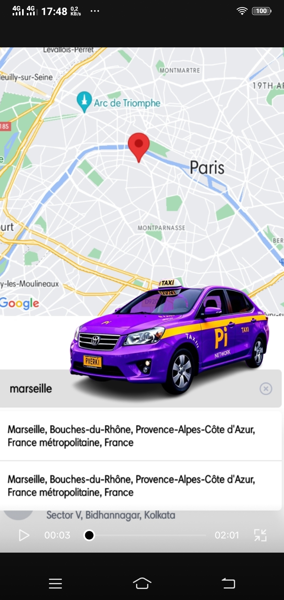

# PI RIDE
<a></a>
<a></a>
<a></a>
<a></a>
<a></a>
<a></a>

Uber Clone built with React Native and Typescript. The UI consists of a search bar and two options, Uber Rides and Uber Eats. (Uber Eats has not been developed as yet) The user can select favourites which consist of home location and work location. After selecting a valid pick-up location and after clicking on Uber Rides, the user navigates to another screen which asks for the drop-location and after the user provides that, he/she navigates to another screen consisting of ride options each having parameters - type of vehicle, travel time and total fare. The user can select any one of the given ride options.

## Usage
Navigate to the root directory and run
```
npm i
```
for installing all the dependencies. To start the application, run
```
npm start
```

You can use an emulator on your pc to use the app or scan the QR code using your Android/iOS device to use it there as well



The user can also select a pick-up location as well as a drop-location from a list of cities, towns, counties, districts etc. from the searchbar having options which have been implemented using OpenStreetMap API. The UI of the mapscreen displays a map which has been implemented using `react-native-maps` package. The uber app uses other react utilities as well.


